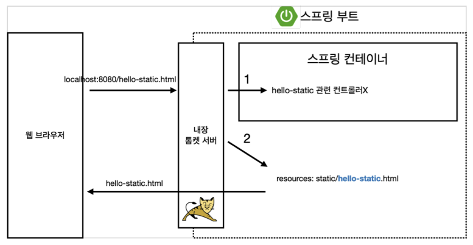
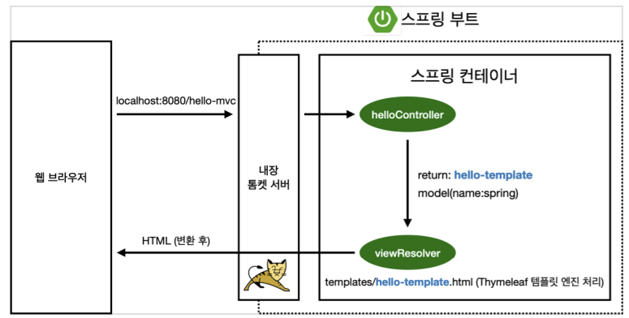
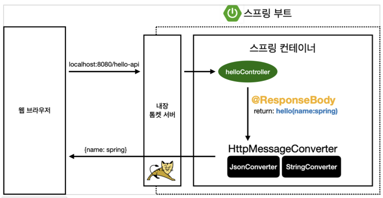

# 스프링 웹 개발 기초

### 정적컨텐츠

- /static 에서 정적컨텐츠를 제공한다.
- /static/hello-static.html
- 그대로 전달한다.
- 웹브라우저에 localhost:8080/hello-static.html
구동방식

- 웹브라우저 url입력
- 내장톰캣서버에서 해당 controller가 있으면 그쪽으로보내는데
- static은 없기때문에 바로 화면 띄워준다.
 
- 정적컨텐츠 구동 이미지 
  

### MVC와 템플릿 엔진

- MVC : model, view, controller의 약자
- 위 3개로 쪼개서
- view를 템플릿엔진으로 프로그래밍하여 랜더링하고
- controller가 rendering된 HTML을 client에게전달
- 역할
    - view : 화면 그자체
    - controller, model: 비즈니스 로직 처리(서버 뒷단)
- MVC, 템플릿 이미지
 

@ReponseBody

- HTTP의 BODY에 문자내용을 직접 반환
- 파라미터에 따라 맞는 converter르 선택하여 전달된다.
    - 단순문자 → StringConverter(StringHttpMessageConverter)
      -  string으로 httpResponse에 바로 넣어 view없이 client에게 전달
    - 객체 → JsonConverter(MappingJackson2HttpMessageConverter)
      - API를 가리킨다.

- @ReponseBody 이미지 

### API

- 객체전달을 가리킨다.
- Json으로 변환하여 httpResponse에 바로 넣어 view없이 client에게 전달
  - …/controller/HelloController
  - Hello객체를 생성 > 값넣고 리턴
  - [localhost:8080/hello-api?name](http://localhost:8080/hello-api?name)=spring!!!
  - 웹브라우저에서 값을 전달하면 JSON으로 나온다.
      - {키 : 값}형식

이미지 출처
인프런_6김영한_스프링 입문 - 코드로 배우는 스프링 부트, 웹 MVC, DB 접근 기술